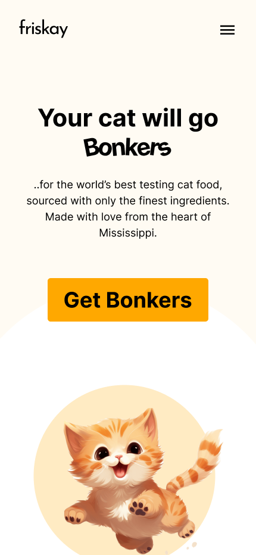

# Kitty Food - Frontend practice

## Reference

### Color

| Name       | Hex    | Color                                                   |
|------------|--------|---------------------------------------------------------|
| Background | FFFBF3 |  |
| Primary    | FFA800 |  |
| Secondary  | E89058 |  |

### Design

On hover

Mobile

|  |  |
|------------------------------------------|---------------------------------------|

Tablet

Desktop

